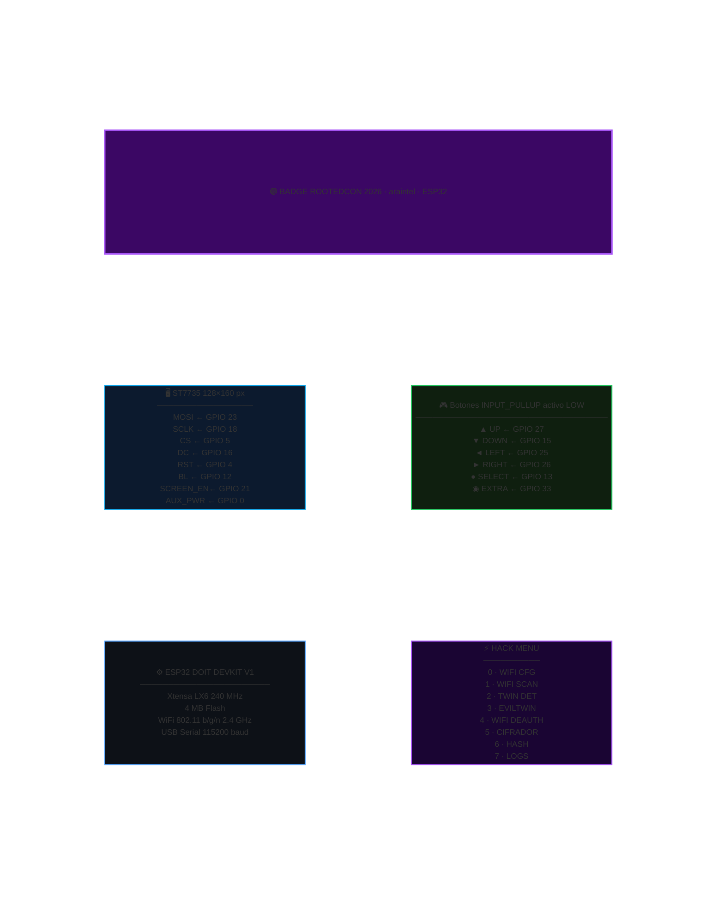
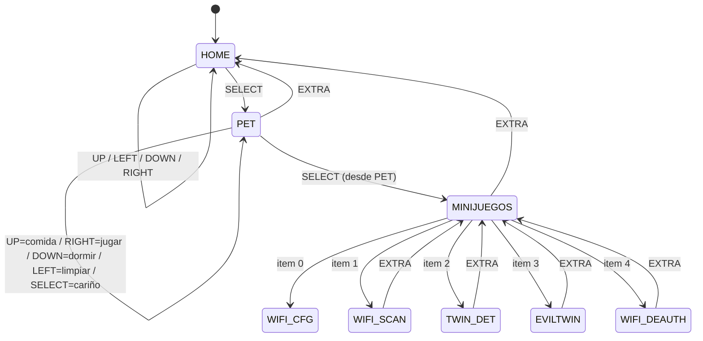
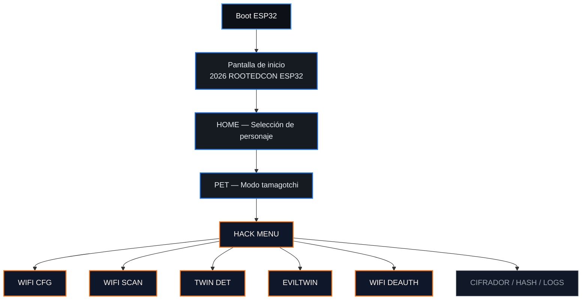
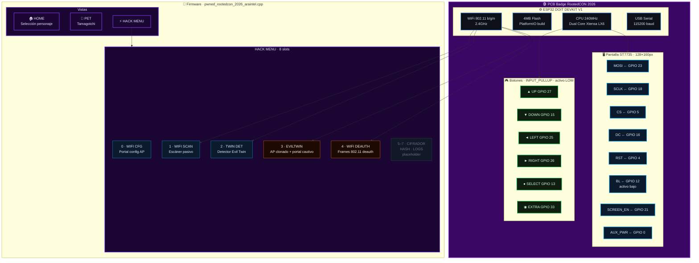

# badge_rootedcon2026_araintel

<p align="center">
	
	
	
	
</p>



---

## Descripción

Proyecto de badge para ESP32 desarrollado para RootedCON 2026. Incluye una interfaz visual con selección de personajes en pixel art, modo tamagotchi, y un **HACK MENU** con herramientas WiFi para uso en auditorías y CTFs.

---

## Hardware necesario

- Placa `ESP32 DOIT DEVKIT V1` o compatible
- Pantalla `ST7735` (128×160 px)
- 6 botones físicos cableados según mapa de pines
- Cable USB para alimentación y flasheo
- `PlatformIO` instalado

---

## Uso rápido

### 1. Clonar el repositorio

```bash
git clone <url-del-repo>
cd badge_rootedcon2026_araintel
```

### 2. Compilar

```bash
pio run -e pwned_rootedcon_2026_araintel
```

### 3. Listar puertos serie disponibles

```bash
pio device list
```

### 4. Flashear

```bash
pio run -e pwned_rootedcon_2026_araintel -t upload --upload-port <puerto>
```

> Si PlatformIO detecta el puerto automáticamente: `pio run -e pwned_rootedcon_2026_araintel -t upload`

### 5. Monitor serie

```bash
pio device monitor -p <puerto> -b 115200 --filter default
```

Ejemplos de puerto según sistema operativo:

| SO      | Puerto típico                              |
|---------|--------------------------------------------|
| macOS   | `/dev/cu.usbserial-XXXX` o `/dev/cu.usbmodemXXXX` |
| Linux   | `/dev/ttyUSB0` o `/dev/ttyACM0`           |
| Windows | `COM3`, `COM4`, `COM5`, etc.              |

---

## Flujo de navegación



---

## Controles

### HOME

| Botón         | Acción              |
|---------------|---------------------|
| UP / LEFT     | personaje anterior  |
| DOWN / RIGHT  | personaje siguiente |
| SELECT        | entrar en PET       |

### PET

| Botón  | Acción       |
|--------|--------------|
| UP     | dar comida   |
| RIGHT  | jugar        |
| DOWN   | dormir       |
| LEFT   | limpiar      |
| SELECT | cariño       |
| EXTRA  | volver atrás |

### HACK MENU (MINIJUEGOS)

| Botón        | Acción                    |
|--------------|---------------------------|
| UP / DOWN    | mover selección           |
| SELECT       | entrar en herramienta     |
| EXTRA        | volver a HOME             |

---

## HACK MENU — Módulos

El HACK MENU se accede desde la vista PET pulsando SELECT en la opción "MINIJUEGOS". Contiene 8 slots; los primeros 5 son herramientas WiFi activas.

### 0 · WIFI CFG

Portal web de configuración WiFi local. El badge levanta un access point y sirve una página para configurar credenciales. Útil para conectar el badge a una red sin recompilar.

**Acceso:** conectarse al AP del badge y abrir `192.168.4.1` en el navegador.

---

### 1 · WIFI SCAN

Escáner pasivo de redes WiFi cercanas. Muestra por cada red:

- SSID
- RSSI (nivel de señal en dBm)
- Canal (CH)
- Tipo de cifrado (OPEN / WEP / WPA / WPA2 / WPA3 / ENT)

Las redes abiertas (`OPEN`) se resaltan en rojo. La lista es paginada (4 redes por página).

| Botón  | Acción               |
|--------|----------------------|
| DOWN   | página siguiente     |
| UP     | página anterior      |
| SELECT | rescanear            |
| EXTRA  | volver al HACK MENU  |

---

### 2 · TWIN DET — Evil Twin Detector

Herramienta **defensiva**. Analiza las redes escaneadas y detecta SSIDs duplicados con distinto BSSID, lo que puede indicar un ataque Evil Twin activo en el entorno.

Para cada par sospechoso muestra:
- SSID en común
- BSSID, canal y cifrado de cada AP
- Diferencia de RSSI

Si no se detecta ningún duplicado, muestra `OK - SIN TWINS` en verde.

| Botón  | Acción                      |
|--------|-----------------------------|
| DOWN   | par siguiente               |
| UP     | par anterior                |
| SELECT | rescanear                   |
| EXTRA  | volver al HACK MENU         |

---

### 3 · EVILTWIN

Crea un access point con el SSID de la red objetivo y levanta un portal cautivo que solicita credenciales WiFi. Pensado para auditorías en entornos controlados donde se tiene autorización explícita del propietario de la red.

El portal es accesible desde cualquier dispositivo que se conecte al AP falso. Las credenciales introducidas se muestran en el monitor serie.

| Botón  | Acción               |
|--------|----------------------|
| EXTRA  | detener y volver     |

> ⚠️ **Solo usar en redes propias o con autorización escrita.** El uso no autorizado es ilegal.

---

### 4 · WIFI DEAUTH

Herramienta de desautenticación 802.11. Permite seleccionar una red de la lista escaneada y enviar frames de deauth hacia los clientes asociados.

Muestra la lista de redes con SSID, BSSID y canal. La red seleccionada se resalta en rojo.

| Botón         | Acción                     |
|---------------|----------------------------|
| UP / LEFT     | selección anterior         |
| DOWN / RIGHT  | selección siguiente        |
| SELECT        | activar / desactivar deauth|
| EXTRA         | volver al HACK MENU        |

> ⚠️ **Solo usar en redes propias o con autorización escrita.** El uso no autorizado es ilegal.

---

### 5–7 · CIFRADOR / HASH / LOGS

Slots reservados para futuras herramientas. Actualmente no tienen implementación activa.

---

## Arquitectura visual



---

## Mapa de pines

### Pantalla ST7735

| Función    | GPIO |
|------------|-----:|
| MOSI       | 23   |
| MISO       | —    |
| SCLK       | 18   |
| CS         | 5    |
| DC         | 16   |
| RST        | 4    |
| BL         | 12   |
| SCREEN_EN  | 21   |
| AUX_POWER  | 0    |

- `BL` está en activo bajo
- `SCREEN_EN` se pone en alto para habilitar la pantalla
- Orientación fijada en código con `setRotation(3)`

### Botones

Todos en `INPUT_PULLUP`, activos en `LOW`.

| Botón  | GPIO |
|--------|-----:|
| UP     | 27   |
| DOWN   | 15   |
| LEFT   | 25   |
| RIGHT  | 26   |
| SELECT | 13   |
| EXTRA  | 33   |

---

## Diagrama del badge

Vista completa del hardware: el ESP32 como núcleo, la pantalla ST7735 conectada por SPI, los botones físicos, y el HACK MENU como capa software encima.



---

## Estructura del proyecto

```text
badge_rootedcon2026_araintel/
├── platformio.ini
├── rooted2026_renvu_badge.csv
├── docs/
│   └── banner.png
└── esp32/
    └── pwned_rootedcon_2026_araintel.cpp
```

- `platformio.ini` — configuración del entorno PlatformIO
- `rooted2026_renvu_badge.csv` — tabla de particiones
- `esp32/pwned_rootedcon_2026_araintel.cpp` — aplicación principal

---

## Git y limpieza del repositorio

El `.gitignore` excluye artefactos locales:

```
.pio/
.DS_Store
.vscode/
platformio_override.ini
```

---

<p align="center">
	<em>Personaliza el banner en <code>docs/banner.png</code> para darle tu toque.</em>
</p>